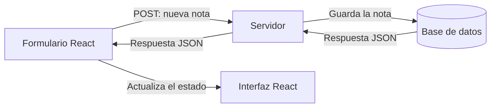

```mermaid
flowchart LR
    A[Formulario React] -->|POST: nueva nota| B[Servidor]
    B -->|Guarda la nota| C[(Base de datos)]
    C -->|Respuesta JSON| B
    B -->|Respuesta JSON| A
    A -->|Actualiza el estado| D[Interfaz React]
```
